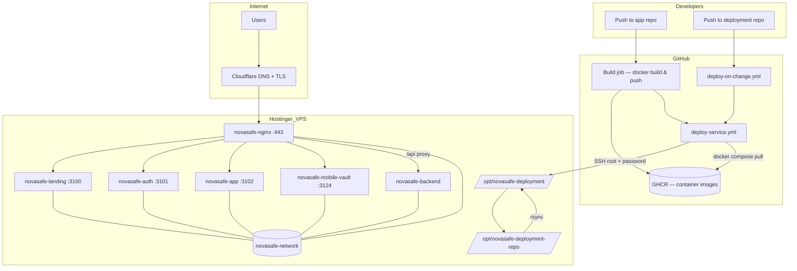
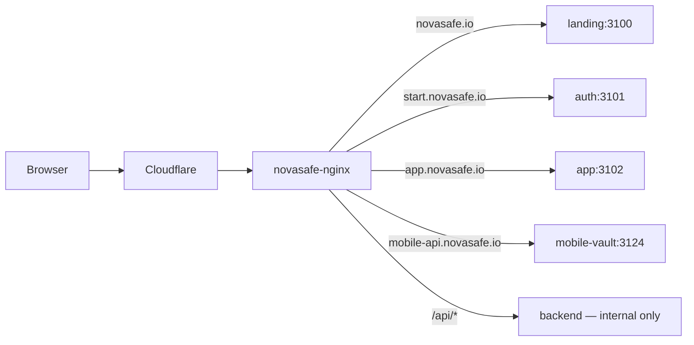
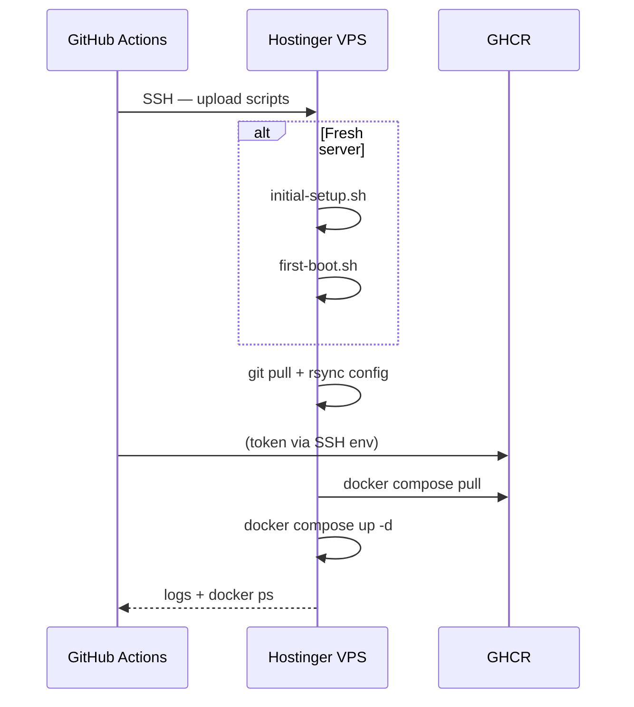

# NovaSafe Deployment — Architecture & Operations Guide

This document explains **how NovaSafe is deployed**, the **full architecture**, and **what happens at each step**. Read this when onboarding, debugging CI, or migrating servers.

For a quick start, see [README.md](./README.md).

---

## Table of contents

1. [Design principles](#1-design-principles)
2. [Repository map](#2-repository-map)
3. [VPS layout](#3-vps-layout)
4. [Architecture diagram](#4-architecture-diagram)
5. [Deploy flows](#5-deploy-flows)
6. [GitHub Actions workflows](#6-github-actions-workflows)
7. [Server scripts](#7-server-scripts)
8. [Services reference](#8-services-reference)
9. [Networking & nginx](#9-networking--nginx)
10. [Secrets & environment files](#10-secrets--environment-files)
11. [Fresh server bootstrap](#11-fresh-server-bootstrap)
12. [Manual operations](#12-manual-operations)
13. [Troubleshooting](#13-troubleshooting)
14. [Related docs](#14-related-docs)

---

## 1. Design principles

| Principle | What it means |
|---|---|
| **Deployment repo = source of truth** | All `docker-compose`, nginx config, and deploy scripts live in `novasafe-deployment`. The VPS never relies on copy-paste from a laptop. |
| **App repos = source of truth for code** | Each frontend/backend repo builds its own Docker image and pushes to GHCR. |
| **Shared deploy workflow** | One reusable workflow (`deploy-service.yml`) handles SSH, sync, and `docker compose up` — app repos only build images and call it. |
| **Selective redeploy** | Pushing deployment config redeploys only changed services (path-based detection). |
| **Independent compose stacks** | Each service has its own `docker-compose.yml` under a folder. All share the external Docker network `novasafe-network`. |
| **Secrets stay on the server** | `.env` files are gitignored and never overwritten by `rsync` or `git pull`. |

---

## 2. Repository map

### This repo (`novasafe-deployment`)

```
novasafe-deployment/
├── .github/workflows/
│   ├── deploy-service.yml      ← reusable workflow (called by app repos)
│   └── deploy-on-change.yml    ← redeploy on push to this repo
├── opt/novasafe-deployment/    ← synced to /opt/novasafe-deployment on VPS
│   ├── deploy.sh               ← main entry point on the server
│   ├── scripts/
│   │   ├── initial-setup.sh    ← fresh VPS bootstrap
│   │   ├── first-boot.sh       ← first-time stack start
│   │   └── lib/logging.sh      ← formatted log output
│   ├── platform/
│   │   ├── app/
│   │   ├── auth/
│   │   └── backend/
│   ├── marketing/
│   │   ├── landing/
│   │   └── mobile-landing/
│   ├── mobile-api/
│   └── infra/
│       ├── nginx/
│       └── portainer/
├── DEPLOYMENT.md               ← this file
└── README.md                   ← short overview
```

### App repos (build images, trigger deploy)

| Repo | GHCR image | Deploy service key |
|---|---|---|
| `novasafe-landing-v2` | `ghcr.io/novasafe-org/novasafe-landing-v2:latest` | `landing` |
| `novasafe-auth-v2` | `ghcr.io/novasafe-org/novasafe-auth-v2:latest` | `auth` |
| `novasafe-app-v2` | `ghcr.io/novasafe-org/novasafe-app-v2:latest` | `app` |
| `novasafe-backend` | `ghcr.io/novasafe-org/novasafe-backend:latest` | `backend` |
| `novasafe-app-landing` | `ghcr.io/novasafe-org/novasafe-app-landing-page:latest` | `mobile-landing` |
| `novasafe-backend` (core) | `ghcr.io/novasafe-org/novasafe-mobile-vault:latest` | `mobile-api` |

Each app repo workflow:

1. Builds and pushes image to GHCR
2. Calls `novasafe-org/novasafe-deployment/.github/workflows/deploy-service.yml@master`

---

## 3. VPS layout

Two paths on the server:

```
/opt/novasafe-deployment-repo/     Git clone of novasafe-deployment (for git pull)
/opt/novasafe-deployment/          Live runtime config (compose, nginx, scripts)
```

Sync flow:

```
git pull in /opt/novasafe-deployment-repo
        ↓
rsync opt/novasafe-deployment/ → /opt/novasafe-deployment/
        (excludes .env, logs — never overwrites secrets)
```

Marker files (created automatically):

| File | Meaning |
|---|---|
| `.novasafe-initial-setup-done` | Docker, network, git clone, and first sync completed |
| `.novasafe-first-boot-done` | First-boot stack start attempted |

---

## 4. Architecture diagram

### High-level



### Request routing



---

## 5. Deploy flows

### Flow A — App repo push (most common)

```
1. Developer pushes to novasafe-app-v2 (main/master)
2. GitHub Actions: build job
   - docker build
   - push ghcr.io/novasafe-org/novasafe-app-v2:latest
3. GitHub Actions: deploy job
   - calls deploy-service.yml with service=app
4. deploy-service.yml on GitHub runner:
   - validates SSH secrets
   - checks out novasafe-deployment
   - SCP bootstrap scripts to VPS /tmp/novasafe-scripts/
   - SSH into VPS as root
5. On VPS (via deploy.sh):
   - ensure-ready (initial-setup + first-boot if needed)
   - sync (git pull + rsync)
   - deploy app (docker compose pull + up -d)
6. Post-deploy: docker ps table in workflow logs
```

### Flow B — Deployment repo push (config only)

```
1. Developer changes e.g. platform/app/docker-compose.yml
2. deploy-on-change.yml runs
3. dorny/paths-filter detects changed paths → ["app"]
4. Matrix deploy: one job per changed service
5. deploy-service.yml runs with service=app, sync_config=true
```

Path → service mapping:

| Changed path under `opt/novasafe-deployment/` | Service key |
|---|---|
| `marketing/landing/**` | `landing` |
| `marketing/mobile-landing/**` | `mobile-landing` |
| `platform/auth/**` | `auth` |
| `platform/app/**` | `app` |
| `platform/backend/**` | `backend` |
| `mobile-api/**` | `mobile-api` |
| `infra/nginx/**` | `nginx` |
| `infra/portainer/**` | `portainer` |
| `deploy.sh` | `sync` |

### Flow C — Fresh VPS (first ever deploy)

No manual bootstrap required. Triggered automatically when `deploy.sh` is missing on the server.

```
1. App repo push → deploy-service.yml
2. SSH: deploy.sh not found → run initial-setup.sh
   - apt install docker, git, rsync
   - docker network create novasafe-network
   - git clone novasafe-deployment → /opt/novasafe-deployment-repo
   - rsync → /opt/novasafe-deployment
3. deploy.sh ensure-ready → first-boot.sh
   - Start nginx (no .env needed)
   - Start backend/auth/app/mobile-api ONLY if .env exists
   - Skip services without .env (logged clearly)
4. Deploy the triggered service
5. User copies .env files manually → push app again → skipped services deploy
```



---

## 6. GitHub Actions workflows

### `deploy-service.yml` (reusable)

**Location:** `.github/workflows/deploy-service.yml`  
**Called by:** all app repos + `deploy-on-change.yml`

**Inputs:**

| Input | Default | Description |
|---|---|---|
| `service` | required | `landing`, `auth`, `app`, `backend`, `mobile-landing`, `mobile-api`, `nginx`, `portainer`, `sync` |
| `sync_config` | `true` | Git pull + rsync before deploy |
| `caller_repo` | — | Shown in logs (which repo triggered) |
| `caller_ref` | — | Branch@sha shown in logs |

**Required secrets** (org-level, `secrets: inherit`):

| Secret | Example |
|---|---|
| `SSH_USER` | `root` |
| `SSH_HOST` | VPS IP |
| `SSH_PASSWORD` | Hostinger root password |
| `DEPLOY_PATH` | `/opt/novasafe-deployment` |

**Optional secrets:**

| Secret | Default |
|---|---|
| `DEPLOY_REPO_PATH` | `/opt/novasafe-deployment-repo` |
| `SSH_PRIVATE_KEY` | — (overrides password if set) |

**Steps (with logging):**

1. Deploy metadata banner
2. Validate secrets
3. Checkout `novasafe-deployment@master`
4. Configure SSH known_hosts
5. Install sshpass
6. SCP scripts to `/tmp/novasafe-scripts/`
7. SSH remote pipeline (streamed logs):
   - Fresh server detection
   - `ensure-ready`
   - `sync` (if enabled)
   - `deploy <service>`
   - Post-deploy `docker ps`

### `deploy-on-change.yml`

Runs on push to `master`/`main` when files under `opt/novasafe-deployment/**` change.

- Job `detect`: path filter → JSON array of service names
- Job `deploy`: matrix over changed services, `max-parallel: 1` (one SSH at a time)

### App repo workflow pattern

```yaml
jobs:
  build:
    # docker build & push to GHCR
  deploy:
    needs: build
    uses: novasafe-org/novasafe-deployment/.github/workflows/deploy-service.yml@master
    with:
      service: app
      caller_repo: ${{ github.repository }}
      caller_ref: ${{ github.ref_name }}@${{ github.sha }}
    secrets: inherit
```

---

## 7. Server scripts

### `deploy.sh` — main entry point

**Path on VPS:** `/opt/novasafe-deployment/deploy.sh`

| Command | Action |
|---|---|
| `ensure-ready` | Run initial-setup + first-boot if markers missing |
| `sync` | `git pull` + `rsync` from repo clone |
| `landing` / `auth` / `app` / … | Sync + deploy one service |
| `nginx-reload` | `nginx -t` + reload without recreate |
| `all` | Full stack (use carefully) |
| `status` | `docker ps` |
| `logs <container>` | Follow container logs |
| `cleanup` | Prune unused images |

**Environment variables:**

| Variable | Default |
|---|---|
| `NOVASAFE_DEPLOY_PATH` | `/opt/novasafe-deployment` |
| `NOVASAFE_DEPLOY_REPO` | `/opt/novasafe-deployment-repo` |
| `GHCR_TOKEN` / `GHCR_USER` | Set by CI for `docker login` |
| `NOVASAFE_SKIP_SYNC` | Skip sync when called internally |
| `NOVASAFE_IN_FIRST_BOOT` | Prevent recursive first-boot |

### `scripts/initial-setup.sh`

Idempotent fresh-server setup:

1. Install packages (`docker.io`, `docker-compose-plugin`, `git`, `rsync`)
2. Start Docker daemon
3. Create `novasafe-network`
4. Clone or pull `novasafe-deployment` repo
5. Rsync to live path
6. Verify required files exist
7. Write `.novasafe-initial-setup-done`

### `scripts/first-boot.sh`

One-time stack start (order matters):

```
nginx → backend → mobile-api → auth → app → landing → mobile-landing → portainer
```

- Services requiring `.env` are **skipped** if file is missing
- nginx failure is fatal; other failures are logged and continuable
- Writes `.novasafe-first-boot-done` when finished

### `scripts/lib/logging.sh`

Colored, structured logs used by all scripts. Set `NS_LOG_COLOR=no` to disable.

---

## 8. Services reference

| Service key | Container name | Image | Port | Needs .env | Public URL |
|---|---|---|---|---|---|
| `landing` | `novasafe-landing` | `novasafe-landing-v2:latest` | 3100 | No | novasafe.io |
| `auth` | `novasafe-auth` | `novasafe-auth-v2:latest` | 3101 | Yes | start.novasafe.io |
| `app` | `novasafe-app` | `novasafe-app-v2:latest` | 3102 | Yes | app.novasafe.io |
| `backend` | `novasafe-backend` | `novasafe-backend:latest` | internal | Yes | via nginx `/api` |
| `mobile-api` | `novasafe-mobile-vault` | `novasafe-mobile-vault:latest` | 3124 | Yes | mobile-api.novasafe.io |
| `mobile-landing` | `mobile-landing` | `novasafe-app-landing-page:latest` | — | No | (per nginx conf) |
| `nginx` | `novasafe-nginx` | `nginx:alpine` | 80, 443 | No | all domains |
| `portainer` | `portainer` | `portainer/portainer-ce` | internal | No | internal-docker.novasafe.io |

**Port plan:** landing 3100, auth 3101, app 3102, mobile-api 3124.  
Upstream ports bind to `127.0.0.1` on the host; public nginx reaches containers via Docker DNS on `novasafe-network`.

---

## 9. Networking & nginx

### Docker network

All compose files attach to:

```yaml
networks:
  novasafe-network:
    external: true
```

Create once: `docker network create novasafe-network`

### Edge nginx

- **Container:** `novasafe-nginx` in `infra/nginx/`
- **Config:** `infra/nginx/conf.d/*.conf` mounted into `/etc/nginx/conf.d`
- **TLS:** Cloudflare origin certificates in `infra/nginx/cloudflare/`
- **Upstream resolution:** Docker service names (`landing:3100`, `auth:3101`, `app:3102`, etc.)

Nginx is the **only** service publishing ports 80/443 to the internet.

### Backend API

Not exposed directly. Nginx proxies `location /api/` to the backend container. Frontend apps call `/api` on their own hostname.

---

## 10. Secrets & environment files

### GitHub secrets (CI — for SSH deploy)

Set at **organization** level:

```
SSH_USER=root
SSH_HOST=<vps-ip>
SSH_PASSWORD=<root-password>
DEPLOY_PATH=/opt/novasafe-deployment
DEPLOY_REPO_PATH=/opt/novasafe-deployment-repo  # optional
```

App repos may also have build-time secrets (`VITE_*`, etc.) for baking URLs into frontend images.

### Server `.env` files (never committed)

| Path | Used by |
|---|---|
| `platform/app/.env` | novasafe-app SSR runtime |
| `platform/auth/.env` | novasafe-auth SSR runtime |
| `platform/backend/.env` | novasafe-backend API |
| `mobile-api/.env` | novasafe-mobile-vault |

`rsync` and `deploy.sh sync` **exclude** `.env` — production secrets on disk are never overwritten by Git.

### Cloudflare origin certs

```
infra/nginx/cloudflare/origin.crt
infra/nginx/cloudflare/origin.key
```

Copy from old server or generate in Cloudflare dashboard. See [CERTIFICATE_SETUP.md](./CERTIFICATE_SETUP.md).

---

## 11. Fresh server bootstrap

### Automatic (recommended)

1. Set GitHub secrets
2. Push `novasafe-deployment` to `master` (workflows must exist)
3. Push any app repo
4. Watch GitHub Actions logs — initial-setup and first-boot run automatically
5. Copy `.env` files and certs to VPS
6. Push app repos again for services that were skipped
7. Update DNS in Cloudflare

### Manual (optional)

```bash
ssh root@YOUR_VPS_IP

export NOVASAFE_DEPLOY_REPO=/opt/novasafe-deployment-repo
export NOVASAFE_DEPLOY_PATH=/opt/novasafe-deployment

bash /opt/novasafe-deployment/scripts/initial-setup.sh
bash /opt/novasafe-deployment/scripts/first-boot.sh
./deploy.sh status
```

---

## 12. Manual operations

```bash
cd /opt/novasafe-deployment

./deploy.sh sync              # pull latest deployment config
./deploy.sh app               # redeploy one service
./deploy.sh nginx-reload      # reload nginx config without downtime
./deploy.sh status            # running containers
./deploy.sh logs novasafe-app # follow logs
./deploy.sh cleanup           # prune old images
```

### Rollback an app image

1. In GHCR, identify previous image tag (e.g. commit SHA)
2. On server, edit `docker-compose.yml` image tag temporarily, or:
   ```bash
   cd platform/app
   docker compose pull
   docker compose up -d
   ```
3. Prefer pinning image tags in compose for production rollbacks

### Re-run first boot

```bash
rm /opt/novasafe-deployment/.novasafe-first-boot-done
./deploy.sh ensure-ready
```

---

## 13. Troubleshooting

| Symptom | Likely cause | Fix |
|---|---|---|
| Deploy job: `Missing SSH_PASSWORD` | Secret not set | Add org secret `SSH_PASSWORD` |
| `deploy.sh not found` | Initial setup failed | SSH in, run `initial-setup.sh` manually |
| `.env missing` | Secrets not copied to VPS | Copy `.env` to correct path, redeploy |
| `502 Bad Gateway` | Upstream container down | `docker ps`, `docker logs <container>` |
| GHCR pull denied | Not logged in on VPS | CI passes `GHCR_TOKEN`; check package permissions |
| `novasafe-network` not found | Network not created | `docker network create novasafe-network` |
| TLS errors in browser | Certs missing/wrong | Check `infra/nginx/cloudflare/`, see CERTIFICATE_SETUP |
| First-boot skips auth/app | No `.env` yet | Expected — copy `.env`, push app repo again |
| Workflow can't call reusable WF | Org policy | Allow `novasafe-deployment` workflows in org Actions settings |

### Useful debug commands

```bash
docker ps -a
docker network inspect novasafe-network
docker logs novasafe-nginx --tail 100
docker exec novasafe-nginx nginx -t
curl -I http://127.0.0.1:3100/health   # landing
curl -I http://127.0.0.1:3102/         # app
```

### Where to read logs

| Location | What |
|---|---|
| GitHub Actions → app repo → deploy job | Full SSH session output, banners, docker ps |
| GitHub Actions → novasafe-deployment → deploy-on-change | Which services changed |
| VPS: `./deploy.sh logs <name>` | Container stdout |
| VPS: `docker logs <name>` | Same |

---

## 14. Related docs

| Doc | Topic |
|---|---|
| [README.md](./README.md) | Quick overview |
| [CERTIFICATE_SETUP.md](./CERTIFICATE_SETUP.md) | TLS for all subdomains |
| [RUN_LOCALLY_AND_PROD.md](./RUN_LOCALLY_AND_PROD.md) | Dev vs production URLs |
| [MOBILE_API_DOMAIN.md](./MOBILE_API_DOMAIN.md) | mobile-api routing |
| [PHASE2_HARDENING.md](./PHASE2_HARDENING.md) | Security hardening notes |

---

*Last updated: reflects Option A shared workflow, automatic initial-setup/first-boot, and Hostinger VPS layout.*
