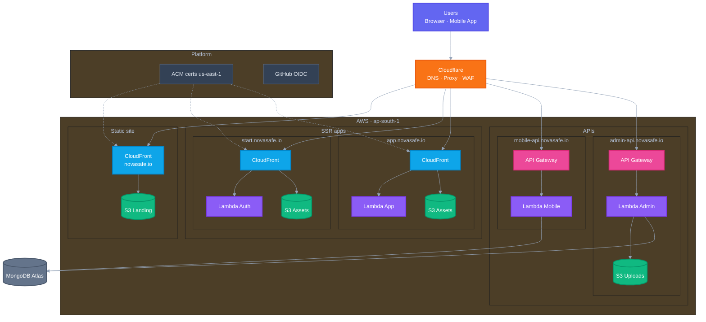

# NovaSafe AWS Architecture

> **Region:** ap-south-1 (Mumbai) · **Account:** 793239449172 · **DNS:** Cloudflare · **Database:** MongoDB Atlas (external)

---

## Architecture diagram

Paste the block below into Notion using `/mermaid`:

### Request flows

| Surface | Flow |
|---------|------|
| **Landing** | User → Cloudflare → CloudFront → S3 |
| **Auth / App** | User → Cloudflare → CloudFront → Lambda (pages) + S3 (`/assets/*`) |
| **APIs** | User → Cloudflare → API Gateway → Lambda → MongoDB Atlas |

---

## Cost estimate

### 5–6 users, very low traffic

| Item | Expected cost |
|------|---------------|
| **AWS total** | **$0 / month** |
| MongoDB Atlas (M0) | $0 |
| Cloudflare DNS | $0 |

Typical monthly usage at this scale:

| Metric | Your usage (est.) | Free tier limit |
|--------|-------------------|-----------------|
| Page views | ~2,000–5,000 | CloudFront: 10M requests |
| API calls | ~5,000–20,000 | Lambda: 1M requests |
| Data transfer | ~0.5–2 GB | CloudFront: 1 TB |
| S3 storage | < 1 GB | 5 GB (first 12 mo) |

> After the AWS account’s first 12 months, S3 and API Gateway may cost a few cents/month at this traffic — still effectively free.

### If traffic grows

| Scale | AWS estimate |
|-------|--------------|
| 5–6 users | $0 |
| ~1,000 users | $5–15 / month |
| ~10,000 users | $30–80 / month |

---

## Free tier limits

### Always free (never expires)

| Service | Monthly allowance | NovaSafe usage |
|---------|-------------------|----------------|
| **Lambda** | 1M requests + 400,000 GB-seconds | 4 functions |
| **CloudFront** | 1 TB egress + 10M requests | 3 distributions |
| **ACM** | Public certs | 5 domains |
| **IAM / OIDC** | — | GitHub deploy |
| **CloudWatch** | 5 GB log ingestion | Lambda + CDN logs |

### Free for first 12 months

| Service | Monthly allowance | After 12 months (low traffic) |
|---------|-------------------|-------------------------------|
| **S3** | 5 GB, 20K GET, 2K PUT | ~$0.10–0.50 / mo |
| **API Gateway HTTP** | 1M requests | ~$0 at 5–6 users |

### Configured limits in CDK

| Resource | Setting |
|----------|---------|
| Lambda SSR (auth, app) | 1024 MB · 29s timeout |
| Lambda API (mobile, admin) | 512 MB · 29s timeout |
| CloudFront price class | PriceClass_100 (US/EU edges) |
| S3 log retention | 90 days |
| CloudWatch retention | 1 month |

---

## Domain → service mapping

| Domain | AWS stack | Pattern | Origin |
|--------|-----------|---------|--------|
| `novasafe.io` | Landing | Static SPA | S3 only |
| `www.novasafe.io` | Landing | Static SPA | S3 only |
| `start.novasafe.io` | Auth | SSR | Lambda + S3 assets |
| `app.novasafe.io` | App | SSR | Lambda + S3 assets |
| `mobile-api.novasafe.io` | mobile-api | API | API Gateway → Lambda |
| `admin-api.novasafe.io` | admin-api | API | API Gateway → Lambda + S3 uploads |

---

## CDK stacks (production)

| Stack | Status | Resources |
|-------|--------|-----------|
| `novasafe-prod-github-oidc` | Live | GitHub OIDC IAM role |
| `novasafe-prod-landing` | Live | S3 + CloudFront |
| `novasafe-prod-auth` | Live | Lambda SSR + CloudFront |
| `novasafe-prod-app` | Live | Lambda SSR + CloudFront |
| `novasafe-prod-mobile-api` | Live | API Gateway + Lambda |
| `novasafe-prod-admin-api` | Live | API Gateway + Lambda + S3 |
| `novasafe-prod-workers` | Planned | SQS / EventBridge |
| `novasafe-prod-observability` | Planned | Dashboards / alarms |

---

## Deploy commands

| Action | Where | How |
|--------|-------|-----|
| Deploy infrastructure | `novasafe-deployment` | Actions → Deploy Infrastructure → Landing / All |
| Deploy landing site | `novasafe-landing-v2` | Actions → Deploy AWS |
| Deploy auth / app | `novasafe-auth-v2` / `novasafe-app-v2` | Actions → Deploy AWS |
| Deploy APIs | `novasafe-backend` | Actions → Deploy AWS |

---

*Last updated: July 2026*
